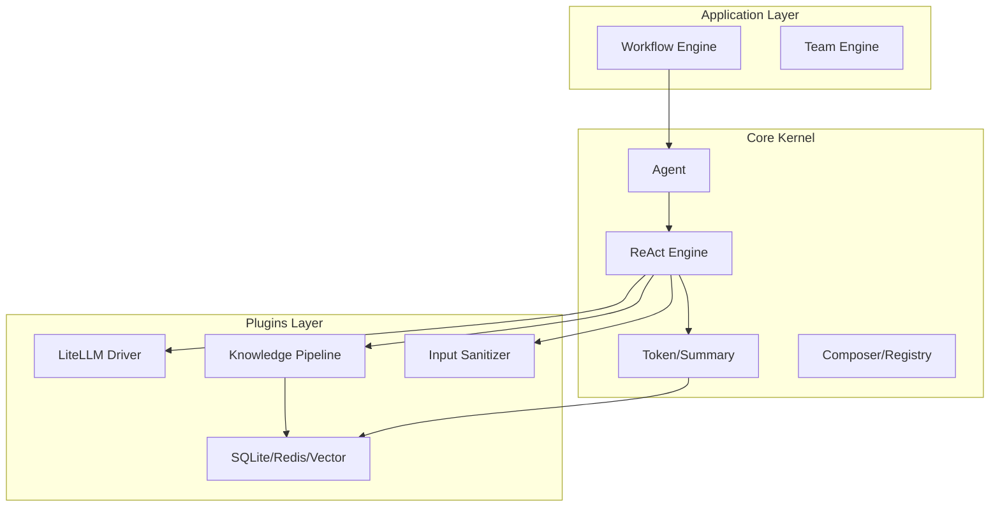

# Gecko Agent Framework (v0.3.1)

> **工业级、异步优先、协议驱动的 Python AI 智能体开发框架**

**Gecko** 是一个专为生产环境设计的 AI Agent 框架。它拒绝“魔法”和过度封装，强调**类型安全**、**并发控制**与**确定性执行**。

v0.3.1 版本在保持核心“异步优先”架构的基础上，新增了 **RAG 知识库流水线**、**模块化 Prompt 引擎**以及 **OpenTelemetry 全链路监控**支持。

## 🌟 核心特性

*   **🚀 原生异步 (Async-First)**: 基于 `anyio` 构建，核心链路全异步。内置线程卸载机制，确保 SQLite/Chroma 等同步 I/O 操作不会阻塞主事件循环。
*   **🧠 知识增强 (RAG)**: 内置生产级 RAG 流水线 (`IngestionPipeline`)，支持文档切分、向量化及混合存储 (Chroma/LanceDB)。
*   **💾 状态持久化与恢复**: Workflow 引擎支持 Step 级状态快照。系统崩溃重启后，调用 `resume()` 即可无缝恢复执行，绝不丢失进度。
*   **📝 模块化 Prompt**: 提供 Prompt 组合器、版本注册表和静态质量检查工具，像管理代码一样管理提示词。
*   **📊 全链路可观测**: 原生集成 OpenTelemetry，自动追踪 Agent 思考过程、工具调用耗时及数据库性能。
*   **🛡️ 企业级鲁棒性**: 内置 `FileLock` 跨进程锁保障数据一致性；内置 `InputSanitizer` 防御 Prompt 注入攻击。

## 架构概览

Gecko 采用微内核 + 插件化架构：

## 文档导航

*   **入门**: [安装指南](install.md) | [快速开始](quickstart.md)
*   **核心指南**: [工作流编排](guides/workflows.md) | [RAG 知识库](guides/rag_pipeline.md) | [Prompt 管理](guides/prompt_management.md)
*   **高级特性**: [结构化输出](guides/structured_output.md) | [可观测性](guides/observability.md)
*   **参考**: [配置详解](configuration.md) | [插件列表](plugins/index.md)