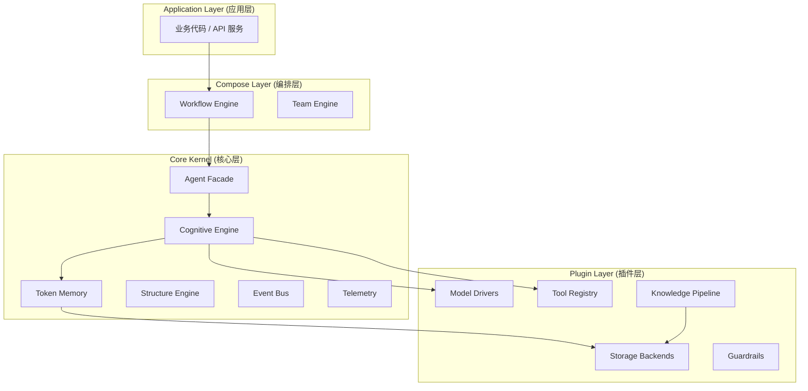

# 架构设计 (Architecture)

Gecko 的设计哲学是 **微内核 (Micro-kernel)** 加 **插件化 (Plugin-based)**。我们致力于提供一个轻量、稳定且类型安全的运行时核心，而将具体实现细节下放给插件层。

## 系统分层

Gecko 自顶向下分为四层：

### 1. 编排层 (Compose Layer)
负责处理复杂的控制流和多智能体协作。
*   **Workflow**: 基于 DAG (有向无环图) 的任务编排。支持条件分支 (`Next`), 循环, 以及最重要的 **状态持久化与恢复 (Resumability)**。
*   **Team**: 并行多智能体协作引擎，支持 Map-Reduce 和 Race (赛马) 模式。

### 2. 核心层 (Core Kernel)
定义了智能体运行的“物理法则”，不依赖具体实现。
*   **Agent**: 统一门面，组装 Model, Memory 和 Tools。
*   **Engine**: 推理循环的核心 (目前内置 `ReActEngine`)。负责 "Think-Act-Observe" 循环、死循环检测、工具结果截断。
*   **Memory**: 负责上下文窗口管理 (Token Counting & Pruning) 和自动摘要。
*   **Structure**: 负责将非结构化的 LLM 文本输出解析为结构化数据 (Pydantic Models)，并具备自动修复能力。

### 3. 插件层 (Plugin Layer)
所有与外部世界的交互都通过协议 (Protocol) 定义在此层。
*   **Models**: 通过 `LiteLLM` 适配 OpenAI, Zhipu, Ollama 等 100+ 模型。
*   **Storage**: 统一 KV 和 Vector 存储接口。支持 SQLite, Redis, ChromaDB, LanceDB。
*   **Guardrails**: 输入清洗与安全防御。

### 4. 基础设施 (Infrastructure)
*   **Async-First**: 基于 `anyio` 构建，核心链路全异步。
*   **Thread Offloading**: 自动将同步 I/O (如 SQLite 写入) 卸载至线程池，防止阻塞事件循环。
*   **Observability**: 原生集成 OpenTelemetry。

---

## 关键设计决策

### 协议驱动 (Protocol-Driven Development)
Gecko 不强制用户继承特定的基类，而是使用 Python 的 `Protocol` (鸭子类型) 来定义接口。这意味着你可以轻松替换底层的实现。例如，任何实现了 `acompletion` 和 `count_tokens` 方法的类都可以作为 Model 使用。

### 确定性执行 (Deterministic Execution)
在 Workflow 中，Gecko 追求确定性。
*   **Atomic State**: 状态更新是原子的。
*   **Pre/Post Commit**: 节点执行前后分别进行状态快照，确保系统崩溃时状态可知。
*   **FileLock**: 在单机多进程环境下，强制使用文件锁保证数据一致性。