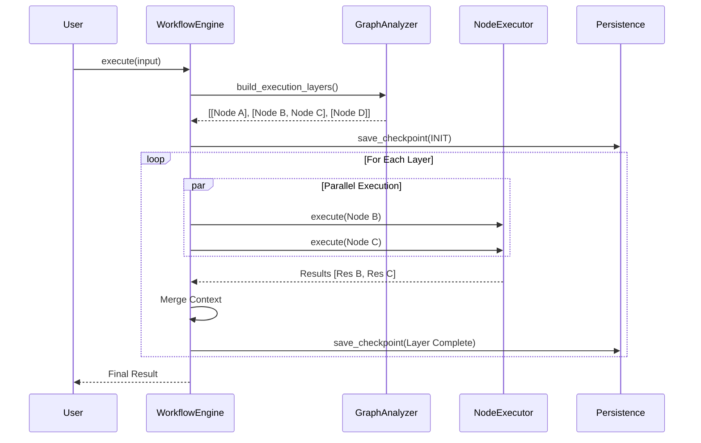

# Gecko v0.4 系统分析与设计方案

## 1. 【系统目标与边界】

### 1.1 系统目标
Gecko v0.4 旨在从一个“单机多Agent原型框架”进化为“生产级Agent编排运行时”。
- **稳定性 (Stability)**：消除 LiteLLM/Pydantic 交互中的序列化崩溃风险，实现进程崩溃后的状态无损恢复。
- **高效性 (Efficiency)**：完整实现 Workflow 的并行图执行（Parallel Graph Execution），优化 Token 计数与 Context 管理的性能开销。
- **鲁棒性 (Robustness)**：引入熔断机制（Circuit Breaker）与更严格的 Guardrails 中间件，防止 Agent 陷入死循环或输出有害内容。
- **可扩展性 (Extensibility)**：标准化插件协议（Plugin Protocol），支持动态加载外部工具包（如 OpenAPI/MCP）。

### 1.2 系统边界
- **输入**：自然语言指令、结构化事件（Webhook）、文件流。
- **输出**：流式文本（SSE）、结构化 JSON、工具执行副作用。
- **外部依赖**：
    - LLM Providers (OpenAI, Anthropic, Ollama 等，通过 LiteLLM 接入)。
    - Vector Databases (Chroma, LanceDB 等)。
    - Application Storage (Redis, SQLite/Postgres)。

---

## 2. 【系统参与者与交互】

| 参与者 | 角色描述 | 关键交互 (v0.4 新增/增强) |
| :--- | :--- | :--- |
| **Developer** | 使用框架构建应用的开发者 | 定义并行工作流图；配置熔断策略；编写自定义 Eval 评测脚本。 |
| **Workflow Engine** | 核心调度器 | 解析 DAG 拓扑；**调度并发层级任务**；处理状态回滚与快照。 |
| **Agent Runtime** | 智能体执行环境 | 维护短期记忆窗口；执行 ReAct/Plan-and-Solve 循环；**流式输出结构化中间状态**。 |
| **External Tool** | 外部 API 或本地函数 | 增加了**沙箱执行环境**（可选）与标准化错误反馈机制。 |

---

## 3. 【系统架构设计】

v0.4 采用 **分层事件驱动架构 (Layered Event-Driven Architecture)**，强化了中间件层和观测层。

```mermaid
graph TD
    User[User/Client] --> API[Interface Layer (CLI/API)]
    API --> Middleware[Middleware Layer (Guardrails/Auth/Tracing)]
    
    subgraph Core Runtime
        Orchestrator[Workflow Orchestrator (DAG)]
        Memory[Memory Manager (Token/Vector)]
        Engine[Cognitive Engine (ReAct/Planner)]
    end
    
    Middleware --> Orchestrator
    Orchestrator --> Engine
    Engine --> Memory
    
    subgraph Plugin System
        ModelDriver[Model Drivers (LiteLLM)]
        ToolBox[ToolBox & Registry]
        Storage[Storage Backends]
    end
    
    Engine --> ModelDriver
    Engine --> ToolBox
    Memory --> Storage
```

### 关键架构升级点：
1.  **并行执行层 (Parallel Execution Layer)**：在 `WorkflowGraph` 中实现 Kahn 算法，将 DAG 转化为分层执行计划。
2.  **混合记忆系统 (Hybrid Memory System)**：在 `TokenMemory` 基础上融合 `SemanticMemory`，实现短期上下文与长期向量检索的自动路由。
3.  **中间件管道 (Middleware Pipeline)**：将 `EventBus` 升级为支持 `pre_hook` 和 `post_hook` 的拦截器模式，用于鉴权、计费和审计。

---

## 4. 【模块功能定义与重构】

### 4.1 Workflow 引擎 (重构重点)
- **现状**：`Graph.build_execution_layers` 只有接口无实现；并行组仅是占位符。
- **v0.4 职责**：
    - **拓扑排序**：实现 BFS/Kahn 算法，解析出可并行的节点层级。
    - **并发调度**：使用 `anyio.create_task_group` 并行执行同一层级的所有节点。
    - **状态合并**：定义并行分支的数据合并策略（Merge Strategy：WaitAll, FirstWin, MapReduce）。

### 4.2 Model IO 层 (增强稳定性)
- **现状**：`LiteLLMAdapter` 解决了部分 Pydantic 兼容性，但异常处理分散。
- **v0.4 职责**：
    - **统一异常映射**：建立 `ProviderError` -> `GeckoModelError` 的映射表，包含是否可重试（Retryable）标记。
    - **熔断器**：当某 Provider 连续失败 N 次，自动降级到备用模型或快速失败。

### 4.3 Memory 模块 (增强智能)
- **现状**：`SummaryTokenMemory` 简单有效，但缺乏语义检索。
- **v0.4 职责**：
    - **Dual-Store**：同时维护 `RecentBuffer` (Redis/Mem) 和 `ArchivalMemory` (Vector DB)。
    - **自动归档**：当 `RecentBuffer` 超出 Token 限制时，不再仅仅 Summarize，而是将重要片段 Embedding 后存入向量库。

---

## 5. 【AI 模块设计】

### 5.1 AI 结构化输出增强
针对 `gecko.core.structure` 模块：
- **Schema 修复**：在 JSON 解析失败时，引入一个小型的 "Repair Agent"（使用低成本模型）尝试修复 JSON 格式，而非仅靠正则替换。
- **Partial Parsing**：在流式输出中，尝试解析不完整的 JSON 片段，实现前端的即时结构化渲染。

### 5.2 动态规划能力 (Dynamic Planner)
引入新的 Engine 类型 `PlannerEngine`：
- **职责**：不直接执行任务，而是生成一个 `Workflow` 配置（DAG）。
- **流程**：User Request -> Planner LLM -> Output JSON DAG -> Gecko Workflow Loader -> Execute。
- **价值**：实现真正的“自主编排”。

---

## 6. 【数据设计】

### 6.1 核心对象优化
**WorkflowContext (gecko/compose/workflow/models.py)**
```python
class WorkflowContext(BaseModel):
    # 新增字段
    execution_plan: List[Set[str]] # 缓存计算好的执行层级
    failed_nodes: Dict[str, str]   # 记录失败节点及原因
    artifacts: Dict[str, Any]      # 存储大文件/二进制数据的引用（非内容）
    
    # 优化 to_storage_payload
    # 增加压缩选项，支持对 history 中过大的文本进行 gzip 压缩存储
```

### 6.2 数据库实体
**SessionModel (SQLite/Postgres)**
- 增加 `version` 字段，支持乐观锁（Optimistic Locking），防止并发写覆盖。
- 增加 `vector_collection_id` 字段，关联该会话专属的向量集合。

---

## 7. 【接口设计】

### 7.1 Workflow 并行定义接口
```python
# 用户侧定义并行更直观
workflow.add_node("fetch_a", func_a)
workflow.add_node("fetch_b", func_b)
# 定义并行：两者都依赖 start，且没有相互依赖
workflow.add_edge("start", "fetch_a")
workflow.add_edge("start", "fetch_b")
# 汇聚
workflow.add_edge("fetch_a", "summarize")
workflow.add_edge("fetch_b", "summarize")
```

### 7.2 插件加载接口 (Plugin Protocol)
```python
class PluginProtocol(Protocol):
    def manifest(self) -> Dict[str, Any]: ...
    def register(self, container: Container) -> None: ...
```
支持通过 `entry_points` 扫描 `gecko.plugins` 命名空间下的包。

---

## 8. 【系统流程图 (Workflow Engine v0.4)】



---

## 9. 【非功能性分析】

1.  **性能 (Performance)**：
    - 目标：Workflow 节点调度延迟 < 5ms。
    - 策略：将 `Graph` 的拓扑分析结果缓存（`@lru_cache`），避免每次 execute 都重新计算 DAG 层级。
    - 策略：`TokenMemory` 计算放入线程池（已在 v0.3.1 实现，需优化线程池复用）。

2.  **可靠性 (Reliability)**：
    - 目标：Process Crash 后，重启能从上一个 Checkpoint 自动恢复。
    - 策略：完善 `PersistenceManager.load_checkpoint`，支持从 `RUNNING` 状态的僵尸节点恢复（重试或跳过）。

3.  **安全性 (Security)**：
    - 策略：完善 `InputSanitizer`，增加针对 SSRF（Server-Side Request Forgery）的工具调用参数检查（如禁止 curl 访问内网 IP）。

---

## 10. 【风险与建议】

### 潜在风险
1.  **Context 爆炸**：并行执行多个分支后合并 Context，如果每个分支都产生大量 Token，合并后容易超出 LLM 窗口。
    *   *修复建议*：在 `WaitAll` 汇聚节点引入“自动摘要合并”策略，而非简单的 list append。
2.  **死锁**：在 `Team` 的 Race 模式中，如果 `cancel_scope` 处理不当，可能导致资源未释放。
    *   *修复建议*：使用 `anyio` 的 `Event` 或 `Condition` 确保资源清理的确定性。

### 交付建议
1.  **P0 优先级**：
    - 实现 `WorkflowGraph` 的拓扑排序算法，打通并行执行。
    - 完善 `LiteLLMDriver` 的错误分类与重试策略。
2.  **P1 优先级**：
    - 实现 RAG 的混合记忆（Hybrid Memory）。
    - 增加 `Evaluator` 模块。
3.  **P2 优先级**：
    - 插件系统的动态加载机制。

---

## 11. 【总结】

Gecko v0.4 的设计核心是将 v0.3.1 中“占位”的并行能力和“硬编码”的流程逻辑彻底工程化。通过引入图算法调度器和更严格的状态管理，Gecko 将能够支撑复杂的企业级 Agent 业务流。