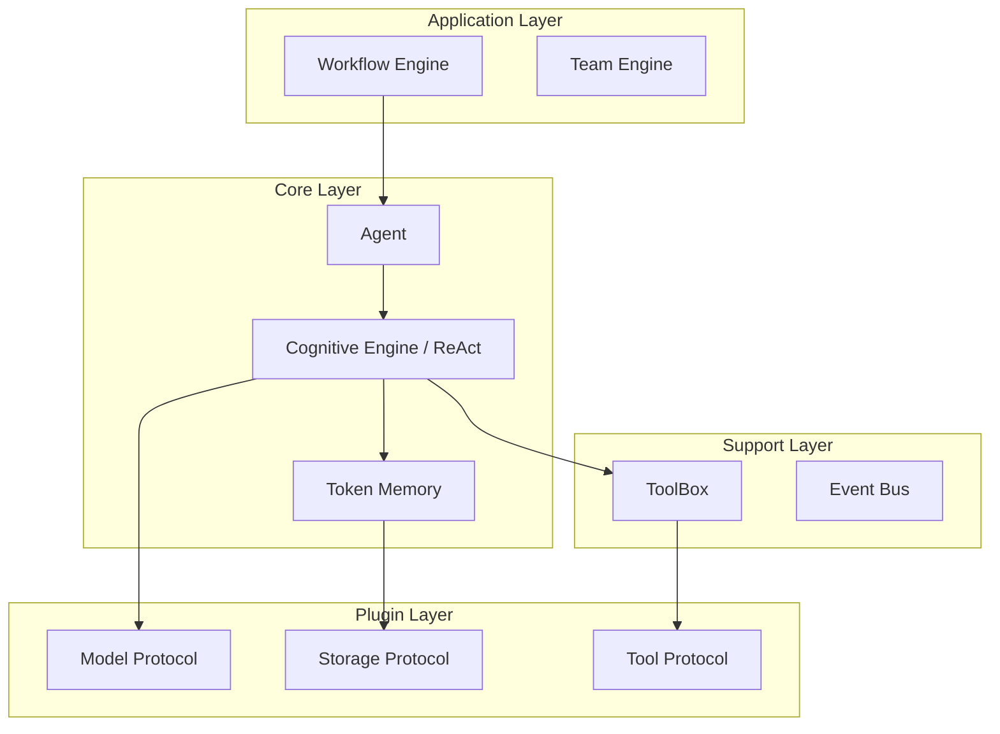

# Gecko Agent Framework 文档

欢迎使用 **Gecko** —— 一个专为生产环境设计的工业级 Python AI 智能体开发框架。

## 🦎 什么是 Gecko?

Gecko 是一个**异步优先 (Async-First)**、**协议驱动 (Protocol-Driven)** 的 Agent 框架。它不追求大而全的“胶水代码”，而是专注于提供一个高可靠、类型安全、可观测的 Agent 运行时环境。

它特别适合构建：
*   高并发的 Agent 后端服务。
*   需要长流程、断点恢复 (Resumable) 的复杂业务流。
*   对数据安全和代码可控性有严格要求的企业级应用。

## 🌟 核心特性

*   **🚀 原生异步**: 基于 `anyio` 构建，核心链路全异步，内置 I/O 线程卸载，杜绝阻塞。
*   **🛡️ 协议驱动**: 通过 Protocol 定义接口，轻松替换底层实现（如从 SQLite 切换到 Redis，从 OpenAI 切换到 Ollama）。
*   **💾 状态持久化**: 支持 Step 级别的状态快照，系统崩溃后可无缝 `resume()`。
*   **🔄 稳健的推理引擎**: 内置死循环检测、观测值智能截断、自动重试机制。
*   **🧩 插件化**: 模块化的 Model, Storage, Tool 设计，支持第三方插件自动发现。

## 🏗️ 系统架构

## 下一步

*   👉 [快速开始](getting_started.md): 5分钟跑通第一个 Agent。
*   👉 [核心概念](core_concepts.md): 了解 Gecko 的运作机理。
*   👉 [编排与工作流](orchestration.md): 学习如何构建复杂的 DAG 任务流。