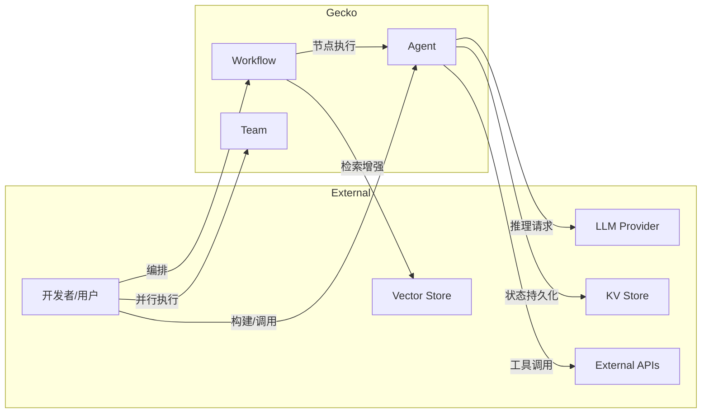
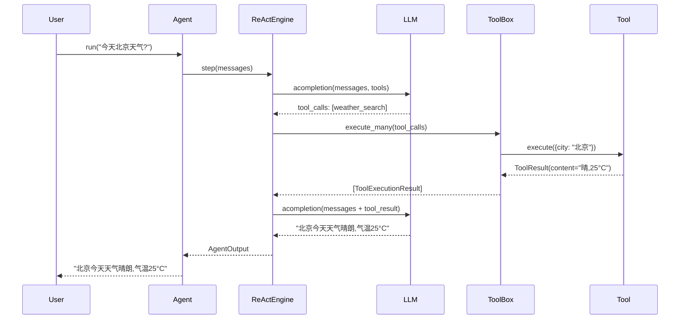
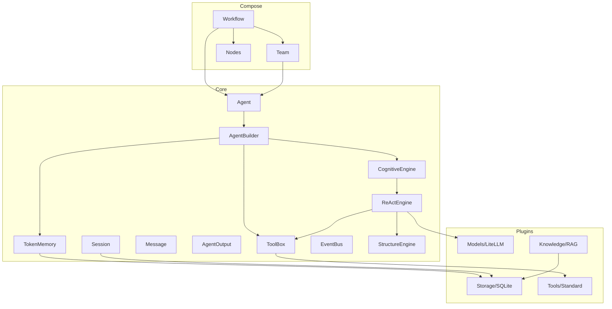
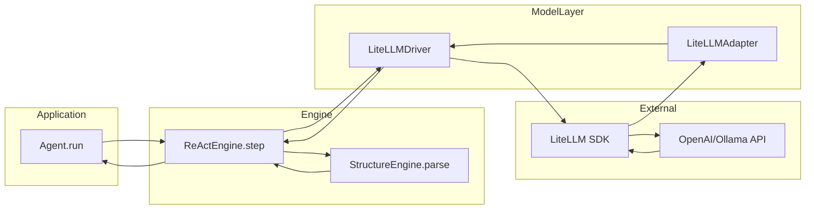
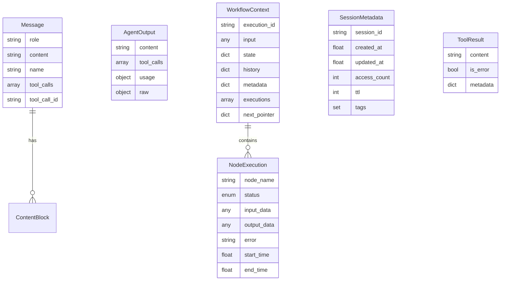
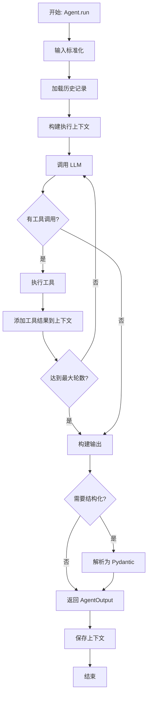
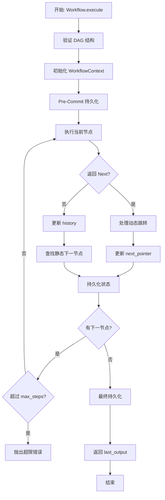
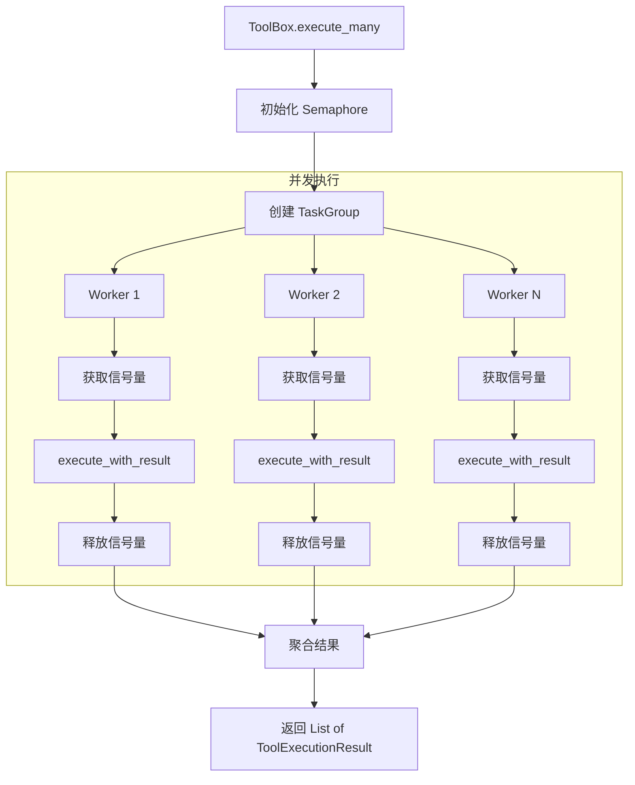

# Gecko AI Agent Framework 系统设计文档 (SDD)

---

## 【系统目标与边界】

### 1.1 系统概述

**Gecko** 是一个企业级 AI Agent 开发框架，提供从单智能体构建到多智能体编排的完整能力栈。框架采用分层架构设计，实现了模型调用、工具执行、记忆管理、工作流编排的解耦与协同。

### 1.2 核心目标

| 目标维度 | 描述 |
|---------|------|
| **功能目标** | 提供可组合的 Agent 构建原语，支持 ReAct 推理、Tool Use、结构化输出、多模态输入 |
| **架构目标** | 插件化设计，模型/存储/工具均可热插拔；支持本地与云端模型统一接入 |
| **性能目标** | 异步优先架构，支持流式输出、并发工具执行、Token 级延迟优化 |
| **可靠性目标** | 完善的异常体系、断点恢复、状态持久化、死循环检测 |

### 1.3 系统边界

```
┌─────────────────────────────────────────────────────────────────┐
│                        Gecko Framework                          │
├─────────────────────────────────────────────────────────────────┤
│  ┌─────────────┐  ┌─────────────┐  ┌─────────────────────────┐  │
│  │  Compose    │  │    Core     │  │        Plugins          │  │
│  │  (编排层)    │  │  (核心层)   │  │       (插件层)          │  │
│  │ ─────────── │  │ ─────────── │  │ ─────────────────────── │  │
│  │ • Workflow  │  │ • Agent     │  │ • Models (LiteLLM)      │  │
│  │ • Team      │  │ • Engine    │  │ • Storage (SQLite/Redis)│  │
│  │ • Nodes     │  │ • Memory    │  │ • Tools (Calculator...) │  │
│  └─────────────┘  │ • Message   │  │ • Knowledge (RAG)       │  │
│                   │ • Session   │  └─────────────────────────┘  │
│                   │ • ToolBox   │                               │
│                   │ • Events    │                               │
│                   └─────────────┘                               │
└─────────────────────────────────────────────────────────────────┘
                              ▲
          ┌───────────────────┼───────────────────┐
          │                   │                   │
    ┌─────┴─────┐      ┌──────┴──────┐     ┌─────┴─────┐
    │ LLM APIs  │      │ Vector DBs  │     │ External  │
    │ (OpenAI,  │      │ (Chroma,    │     │  Tools    │
    │  Ollama)  │      │  LanceDB)   │     │  (HTTP)   │
    └───────────┘      └─────────────┘     └───────────┘
```

### 1.4 关键约束

| 约束类型 | 约束内容 |
|---------|---------|
| **技术约束** | Python 3.10+, asyncio 原生支持, Pydantic v2 数据校验 |
| **依赖约束** | 核心依赖: `litellm`, `pydantic`, `anyio`, `sqlmodel`; 可选: `chromadb`, `redis` |
| **协议约束** | 模型层兼容 OpenAI Chat Completion API; 存储层实现 Protocol 接口 |
| **安全约束** | 工具执行沙箱化 (AST 解析); 无远程代码执行能力 |

---

## 【系统参与者与交互】

### 2.1 主要角色



### 2.2 核心用例

| 用例ID | 用例名称 | 参与者 | 描述 |
|--------|---------|--------|------|
| UC-01 | 单轮对话 | 开发者, LLM | 构建 Agent 并执行单次问答 |
| UC-02 | 工具调用 | Agent, Tool, LLM | Agent 识别意图后调用工具获取信息 |
| UC-03 | 流式输出 | 用户, Agent | 实时返回生成 Token，降低首字延迟 |
| UC-04 | 结构化提取 | Agent, LLM | 将自然语言转换为 Pydantic 模型 |
| UC-05 | 工作流编排 | 开发者, Workflow | 定义 DAG 节点，实现多步骤任务 |
| UC-06 | 并行执行 | Team, Agents | 多 Agent 并发处理同一任务 |
| UC-07 | 断点恢复 | Workflow, Storage | 从持久化状态恢复中断的工作流 |
| UC-08 | RAG 检索 | Agent, VectorStore | 从知识库检索相关文档增强回答 |

### 2.3 关键时序图

#### UC-02: 工具调用时序



---

## 【系统架构设计】

### 3.1 分层架构

```
┌────────────────────────────────────────────────────────────────────┐
│                         Application Layer                          │
│                    (用户代码 / Workflow 定义)                        │
├────────────────────────────────────────────────────────────────────┤
│                         Compose Layer                              │
│  ┌──────────────┐  ┌──────────────┐  ┌──────────────────────────┐  │
│  │   Workflow   │  │     Team     │  │     Nodes (step)         │  │
│  │  DAG 引擎    │  │  并行执行器   │  │   节点装饰器/控制流       │  │
│  └──────────────┘  └──────────────┘  └──────────────────────────┘  │
├────────────────────────────────────────────────────────────────────┤
│                          Core Layer                                │
│  ┌─────────┐ ┌─────────┐ ┌─────────┐ ┌─────────┐ ┌─────────────┐  │
│  │  Agent  │ │ Engine  │ │ Memory  │ │ToolBox │ │   Events    │  │
│  │ 智能体  │ │ 推理引擎 │ │ 记忆管理 │ │工具箱  │ │  事件总线   │  │
│  └─────────┘ └─────────┘ └─────────┘ └─────────┘ └─────────────┘  │
│  ┌─────────┐ ┌─────────┐ ┌─────────┐ ┌─────────────────────────┐  │
│  │ Message │ │ Output  │ │ Session │ │      Protocols          │  │
│  │ 消息模型 │ │ 输出模型 │ │ 会话管理 │ │    接口协议定义          │  │
│  └─────────┘ └─────────┘ └─────────┘ └─────────────────────────┘  │
├────────────────────────────────────────────────────────────────────┤
│                         Plugin Layer                               │
│  ┌─────────────┐  ┌─────────────┐  ┌─────────────┐  ┌──────────┐  │
│  │   Models    │  │   Storage   │  │    Tools    │  │Knowledge │  │
│  │ LiteLLM驱动 │  │ SQLite/Redis│  │ 标准工具库   │  │ RAG管道  │  │
│  └─────────────┘  └─────────────┘  └─────────────┘  └──────────┘  │
├────────────────────────────────────────────────────────────────────┤
│                       Infrastructure Layer                         │
│          (LiteLLM / SQLAlchemy / ChromaDB / Redis Client)          │
└────────────────────────────────────────────────────────────────────┘
```

### 3.2 核心模块依赖关系



---

## 【模块功能定义】

### 4.1 Core 层模块

#### 4.1.1 Agent (`gecko/core/agent.py`)

| 属性/方法 | 类型 | 说明 |
|-----------|------|------|
| `model` | ModelProtocol | 注入的 LLM 模型 |
| `toolbox` | ToolBox | 工具集合 |
| `memory` | TokenMemory | Token 感知记忆 |
| `engine` | CognitiveEngine | 推理引擎 (默认 ReAct) |
| `run(messages)` | async | 单次推理入口 |
| `stream(messages)` | async generator | 流式推理入口 |

**输入**: `str | Message | List[Message] | dict`
**输出**: `AgentOutput | BaseModel` (结构化)

#### 4.1.2 ReActEngine (`gecko/core/engine/react.py`)

```
核心职责:
1. Thought-Action-Observation 循环
2. 工具调用解析与执行
3. 死循环检测 (Hash-based)
4. 观测值截断 (防 Context 溢出)
5. 结构化输出解析与重试
```

| 关键参数 | 默认值 | 说明 |
|---------|--------|------|
| `max_turns` | 5 | 最大推理轮数 |
| `max_observation_length` | 2000 | 工具输出最大字符 |
| `system_prompt` | 内置模板 | 可自定义 Jinja2 模板 |

#### 4.1.3 TokenMemory (`gecko/core/memory.py`)

```python
# 核心算法: 滑动窗口 + LRU 缓存
class TokenMemory:
    def get_history(raw_messages, preserve_system) -> List[Message]:
        """
        1. 解析消息列表
        2. 分离 System Prompt
        3. 反向累积直到达到 max_tokens
        4. 返回时间正序的消息列表
        """
```

**缓存策略**: MD5(message_content) → token_count

#### 4.1.4 ToolBox (`gecko/core/toolbox.py`)

| 功能 | 实现方式 |
|------|---------|
| 工具注册 | `add_tool(tool: BaseTool \| str)` |
| 单次执行 | `execute(name, arguments)` |
| 批量并发 | `execute_many(tool_calls)` + Semaphore |
| Schema 生成 | `to_openai_schema()` |
| 执行统计 | 线程安全的计数器 |

#### 4.1.5 EventBus (`gecko/core/events/bus.py`)

```python
# 发布-订阅模式
bus.subscribe("run_completed", handler)
await bus.publish(AgentRunEvent(type="run_completed", data=...))

# 支持中间件
bus.add_middleware(logging_middleware)
```

### 4.2 Compose 层模块

#### 4.2.1 Workflow (`gecko/compose/workflow.py`)

| 核心概念 | 说明 |
|---------|------|
| Node | 可调用对象 (函数/Agent/Team) |
| Edge | 节点间连接，支持条件分支 |
| Context | 执行上下文，含 state/history |
| Next | 动态跳转指令 |

**状态持久化策略**:
```python
class CheckpointStrategy(Enum):
    ALWAYS = "always"   # 每步保存
    FINAL = "final"     # 仅结束保存
    MANUAL = "manual"   # 手动控制
```

**断点恢复流程**:
```
resume(session_id)
  ├─ 加载 saved_data
  ├─ 重建 WorkflowContext
  ├─ 检查 next_pointer (动态跳转)
  ├─ 或基于静态图推导下一节点
  └─ 继续 _execute_loop
```

#### 4.2.2 Team (`gecko/compose/team.py`)

```python
# Map-Reduce 并行模式
team = Team(members=[agent1, agent2, func], max_concurrent=3)
results: List[MemberResult] = await team.run(input_data)

# 返回结构
class MemberResult:
    result: Any
    error: Optional[str]
    member_index: int
    is_success: bool
```

### 4.3 Plugin 层模块

#### 4.3.1 Models (`gecko/plugins/models/`)

```
架构: Config → Factory → Registry → Driver

ModelConfig
    ├─ model_name: str
    ├─ driver_type: str ("litellm")
    ├─ api_key / base_url
    └─ supports_*: bool (能力标识)

LiteLLMDriver (implements ModelProtocol)
    ├─ acompletion(messages) → CompletionResponse
    ├─ astream(messages) → AsyncIterator[StreamChunk]
    └─ count_tokens(text) → int
```

**预设模型**:
- `OpenAIChat`, `OpenAIEmbedder`
- `OllamaChat`, `OllamaEmbedder`
- `ZhipuChat`

#### 4.3.2 Storage (`gecko/plugins/storage/`)

```
接口层:
├─ SessionInterface (KV 存储)
│   ├─ get(session_id) → Dict
│   ├─ set(session_id, state)
│   └─ delete(session_id)
│
└─ VectorInterface (向量存储)
    ├─ upsert(documents)
    └─ search(query_embedding, top_k, filters)

实现层:
├─ SQLiteStorage (SessionInterface)
├─ RedisStorage (SessionInterface)
├─ ChromaStorage (VectorInterface + SessionInterface)
└─ LanceDBStorage (VectorInterface)
```

**Mixin 设计**:
- `ThreadOffloadMixin`: 同步 IO 卸载到线程池
- `AtomicWriteMixin`: 协程锁 + 文件锁 (跨进程)
- `JSONSerializerMixin`: 标准序列化

#### 4.3.3 Tools (`gecko/plugins/tools/`)

```python
# 工具定义范式
class MyArgs(BaseModel):
    param: str = Field(..., description="参数说明")

@register_tool("my_tool")
class MyTool(BaseTool):
    name = "my_tool"
    description = "工具描述"
    args_schema = MyArgs
    
    async def _run(self, args: MyArgs) -> ToolResult:
        return ToolResult(content="结果")
```

**内置工具**:
| 工具名 | 功能 | 安全措施 |
|--------|------|---------|
| `calculator` | 数学计算 | AST 白名单解析 |
| `duckduckgo_search` | 网页搜索 | 输入长度限制 |

---

## 【AI模块设计】

### 5.1 模型调用链路



### 5.2 推理闭环设计

```
┌─────────────────────────────────────────────────────────────┐
│                    ReAct Loop (max_turns)                   │
├─────────────────────────────────────────────────────────────┤
│                                                             │
│  ┌─────────┐    ┌─────────┐    ┌─────────┐    ┌─────────┐  │
│  │ Context │───▶│  LLM    │───▶│ Parse   │───▶│ Decision│  │
│  │ Build   │    │ Call    │    │Response │    │         │  │
│  └─────────┘    └─────────┘    └─────────┘    └────┬────┘  │
│       ▲                                            │        │
│       │         ┌──────────────────────────────────┼────┐   │
│       │         ▼                                  ▼    │   │
│       │    ┌─────────┐                        ┌────────┐│   │
│       │    │  Tool   │◀── has_tool_calls ────│ Return ││   │
│       │    │ Execute │                        │ Output ││   │
│       │    └────┬────┘                        └────────┘│   │
│       │         │                                  ▲    │   │
│       │         ▼                                  │    │   │
│       │    ┌─────────┐                             │    │   │
│       └────│  Add    │─────── no_tool_calls ───────┘    │   │
│            │ Results │                                  │   │
│            └─────────┘                                  │   │
│                                                         │   │
│  ┌──────────────────────────────────────────────────────┘   │
│  │ Safety Checks:                                           │
│  │ • 死循环检测 (Hash 比对)                                  │
│  │ • 连续错误计数                                            │
│  │ • 观测值截断                                              │
│  └──────────────────────────────────────────────────────────┘
└─────────────────────────────────────────────────────────────┘
```

### 5.3 结构化输出策略

```python
# 策略优先级
1. Tool Call 提取 (OpenAI Function Calling)
   └─ 从 tool_calls[].function.arguments 解析 JSON

2. Markdown 代码块提取
   └─ 正则匹配 ```json ... ```

3. 暴力括号匹配
   └─ 栈匹配 {...} 块，按长度排序

4. JSON 清洗 + 重试
   └─ 移除注释、修复尾逗号
```

### 5.4 Token 管理策略

```
TokenMemory 工作流:
                                    
┌─────────────┐    ┌─────────────┐    ┌─────────────┐
│ Raw Messages│───▶│ Count Tokens│───▶│ Sliding     │
│ from Storage│    │ (LRU Cache) │    │ Window      │
└─────────────┘    └─────────────┘    └─────────────┘
                          │                   │
                          ▼                   ▼
                   ┌─────────────┐    ┌─────────────┐
                   │ tiktoken /  │    │ [System] +  │
                   │ Driver.count│    │ [Recent N]  │
                   └─────────────┘    └─────────────┘
```

---

## 【数据设计】

### 6.1 核心数据实体



### 6.2 存储 Schema

#### SQLite Session 表
```sql
CREATE TABLE gecko_sessions (
    session_id TEXT PRIMARY KEY,
    state_json TEXT NOT NULL DEFAULT '{}'
);

-- 启用 WAL 模式
PRAGMA journal_mode=WAL;
PRAGMA synchronous=NORMAL;
```

#### ChromaDB Collection Schema
```python
# Vector Collection
collection.upsert(
    ids=["doc_1", "doc_2"],
    embeddings=[[0.1, 0.2, ...], [0.3, 0.4, ...]],
    metadatas=[{"source": "file.txt"}, {"source": "file2.txt"}],
    documents=["text content 1", "text content 2"]
)

# Session Collection (JSON in documents)
session_collection.upsert(
    ids=["session_123"],
    documents=['{"state": {...}, "metadata": {...}}']
)
```

### 6.3 数据流转图

```
User Input
    │
    ▼
┌───────────────────────────────────────────────────────┐
│ Agent._normalize_messages()                           │
│   str → Message.user(text)                            │
│   dict → Message(**dict) or Message.user(dict[input]) │
│   List[dict] → [Message(**d) for d in list]           │
└───────────────────────────────────────────────────────┘
    │
    ▼
┌───────────────────────────────────────────────────────┐
│ TokenMemory.get_history()                             │
│   Load from Storage → Parse → Count → Sliding Window  │
└───────────────────────────────────────────────────────┘
    │
    ▼
┌───────────────────────────────────────────────────────┐
│ ReActEngine._build_execution_context()                │
│   [System] + [History] + [Input] → ExecutionContext   │
└───────────────────────────────────────────────────────┘
    │
    ▼
┌───────────────────────────────────────────────────────┐
│ LLM Call (acompletion / astream)                      │
│   messages → LiteLLM → Response → LiteLLMAdapter      │
└───────────────────────────────────────────────────────┘
    │
    ▼
┌───────────────────────────────────────────────────────┐
│ Tool Execution (if tool_calls present)                │
│   tool_calls → ToolBox.execute_many → ToolResult[]    │
└───────────────────────────────────────────────────────┘
    │
    ▼
┌───────────────────────────────────────────────────────┐
│ AgentOutput Construction                              │
│   content + tool_calls + usage → AgentOutput          │
└───────────────────────────────────────────────────────┘
    │
    ▼
┌───────────────────────────────────────────────────────┐
│ Storage Persistence                                   │
│   Session.save() → Storage.set(session_id, state)     │
└───────────────────────────────────────────────────────┘
```

---

## 【接口设计】

### 7.1 协议接口 (Protocol)

#### ModelProtocol
```python
@runtime_checkable
class ModelProtocol(Protocol):
    async def acompletion(
        self, 
        messages: List[Dict[str, Any]], 
        **kwargs
    ) -> CompletionResponse: ...
    
    def count_tokens(
        self, 
        text_or_messages: str | List[Dict[str, Any]]
    ) -> int: ...
```

#### StreamableModelProtocol
```python
@runtime_checkable
class StreamableModelProtocol(ModelProtocol, Protocol):
    async def astream(
        self, 
        messages: List[Dict[str, Any]], 
        **kwargs
    ) -> AsyncIterator[StreamChunk]: ...
```

#### SessionInterface
```python
@runtime_checkable
class SessionInterface(Protocol):
    async def get(self, session_id: str) -> Optional[Dict[str, Any]]: ...
    async def set(self, session_id: str, state: Dict[str, Any]) -> None: ...
    async def delete(self, session_id: str) -> None: ...
```

#### VectorInterface
```python
@runtime_checkable
class VectorInterface(Protocol):
    async def upsert(self, documents: List[Dict[str, Any]]) -> None: ...
    async def search(
        self, 
        query_embedding: List[float], 
        top_k: int = 5,
        filters: Optional[Dict[str, Any]] = None
    ) -> List[Dict[str, Any]]: ...
```

### 7.2 公开 API

#### Agent API
```python
# 构建
agent = (
    AgentBuilder()
    .with_model(OpenAIChat(api_key="..."))
    .with_tools([CalculatorTool(), DuckDuckGoSearchTool()])
    .with_storage(await create_storage("sqlite:///data.db"))
    .with_session_id("user_123")
    .with_system_prompt("You are a helpful assistant.")
    .build()
)

# 执行
output: AgentOutput = await agent.run("1+1等于多少?")
print(output.content)  # "1+1等于2"

# 流式
async for chunk in agent.stream("讲个故事"):
    print(chunk, end="", flush=True)

# 结构化输出
class Answer(BaseModel):
    result: int
    
output: Answer = await agent.run("1+1=?", response_model=Answer)
print(output.result)  # 2
```

#### Workflow API
```python
# 定义
workflow = Workflow(name="ReviewPipeline", storage=storage)
workflow.add_node("analyze", analyze_agent)
workflow.add_node("review", review_agent)
workflow.add_node("approve", approve_func)

workflow.add_edge("analyze", "review")
workflow.add_edge("review", "approve", condition=lambda ctx: ctx.state.get("score") > 80)

workflow.set_entry_point("analyze")

# 执行
result = await workflow.execute("Review this document", session_id="wf_001")

# 恢复
result = await workflow.resume(session_id="wf_001")
```

#### Storage API
```python
# 创建存储
storage = await create_storage("sqlite:///./data.db")
storage = await create_storage("redis://localhost:6379?ttl=3600")
storage = await create_storage("chroma:///./chroma_db?collection=docs")

# 使用
await storage.set("key", {"data": "value"})
data = await storage.get("key")
await storage.delete("key")

# 向量搜索
results = await vector_store.search(
    query_embedding=[0.1, 0.2, ...],
    top_k=5,
    filters={"source": "doc.pdf"}
)
```

### 7.3 事件接口

```python
# 订阅事件
bus = EventBus()
bus.subscribe("run_started", lambda e: print(f"Started: {e.data}"))
bus.subscribe("tool_execution_start", handle_tool_start)
bus.subscribe("*", global_logger)  # 通配符

# 事件类型
| 事件类型 | 触发时机 | 数据内容 |
|---------|---------|---------|
| run_started | Agent.run 开始 | input_count |
| run_completed | Agent.run 完成 | output |
| run_error | Agent.run 异常 | error |
| stream_started | stream 开始 | - |
| tool_execution_start | 工具执行前 | tools[] |
| tool_execution_end | 工具执行后 | result_count |
| node_started | Workflow 节点开始 | node |
| node_completed | Workflow 节点完成 | node, duration |
| workflow_completed | Workflow 完成 | summary |
```

---

## 【系统流程图】

### 8.1 Agent 执行流程



### 8.2 Workflow 执行流程



### 8.3 工具执行并发流程



---

## 【非功能性分析】

### 9.1 性能指标

| 指标 | 目标值 | 实现方式 |
|------|-------|---------|
| **首字延迟 (TTFT)** | < 500ms | 流式输出 + 直接透传 |
| **Token 计数缓存命中率** | > 80% | LRU 缓存 + MD5 Key |
| **工具并发数** | 可配置 (默认5) | Semaphore 控制 |
| **存储 IO 阻塞** | 0 (主线程) | ThreadOffloadMixin |
| **Workflow 恢复时间** | < 1s | 增量状态 + next_pointer |

### 9.2 安全策略

| 风险点 | 缓解措施 |
|-------|---------|
| **代码注入 (Calculator)** | AST 白名单解析，禁止属性访问/下标 |
| **Prompt 注入** | 工具输出截断 (max_observation_length) |
| **API Key 泄露** | Config 对象封装，不序列化敏感字段 |
| **DoS 攻击** | 表达式长度限制、指数上限、搜索结果数限制 |
| **并发写冲突** | AtomicWriteMixin (协程锁 + 文件锁) |

### 9.3 可扩展性设计

```
扩展点:
├─ 模型扩展
│   ├─ 实现 ModelProtocol
│   └─ 使用 @register_driver 注册
│
├─ 存储扩展
│   ├─ 继承 AbstractStorage
│   ├─ 实现 SessionInterface / VectorInterface
│   └─ 使用 @register_storage 注册
│
├─ 工具扩展
│   ├─ 继承 BaseTool
│   ├─ 定义 args_schema
│   └─ 使用 @register_tool 注册
│
└─ 引擎扩展
    ├─ 继承 CognitiveEngine
    └─ 重写 step / step_stream
```

### 9.4 容错机制

| 场景 | 处理方式 |
|------|---------|
| LLM API 超时 | 可配置 timeout + 重试 (enable_retry) |
| 工具执行失败 | 返回 ToolResult(is_error=True)，反馈给 LLM |
| 连续工具错误 | 3 次后注入警告消息 |
| 推理死循环 | Hash 检测 + 强制中断 + 警告注入 |
| Workflow 中断 | Pre-Commit 持久化 + next_pointer 恢复 |
| 存储连接失败 | 初始化时抛出 StorageError |

---

## 【风险与建议】

### 10.1 已识别风险

| 风险ID | 风险描述 | 严重度 | 缓解建议 |
|--------|---------|--------|---------|
| R-01 | LiteLLM 依赖的 Pydantic 兼容性问题 | 中 | 已通过 LiteLLMAdapter 手动映射解决 |
| R-02 | SQLite 多进程并发写入冲突 | 高 | 已引入 FileLock，建议生产环境使用 PostgreSQL |
| R-03 | Token 计数与实际模型不一致 | 低 | 注入 model_driver，优先使用模型层计数 |
| R-04 | Workflow 状态序列化失败 | 中 | safe_serialize_context 处理不可序列化对象 |
| R-05 | 工具执行超时堆积 | 中 | Semaphore 限流，建议监控队列深度 |

### 10.2 架构优化建议

1. **可观测性增强**
   - 集成 OpenTelemetry Tracing
   - 添加 Prometheus Metrics 导出
   - 结构化日志增加 trace_id

2. **缓存层优化**
   - Token 计数缓存可考虑 Redis 共享
   - 工具 Schema 预编译缓存

3. **模型层增强**
   - 添加 Fallback 模型配置
   - 支持模型路由 (Router)
   - 添加请求限流 (Rate Limiter)

4. **存储层优化**
   - 添加连接池管理
   - 支持读写分离 (PostgreSQL)
   - 向量存储分片支持

---

## 【总结与交付建议】

### 11.1 设计完备性评估

| 维度 | 完备度 | 说明 |
|------|-------|------|
| 功能覆盖 | ⭐⭐⭐⭐⭐ | Agent/Workflow/RAG 完整 |
| 接口设计 | ⭐⭐⭐⭐⭐ | Protocol 清晰，扩展性强 |
| 错误处理 | ⭐⭐⭐⭐ | 异常体系完善，部分边界需加强 |
| 可测试性 | ⭐⭐⭐⭐ | 依赖注入良好，Mock 友好 |
| 文档完备 | ⭐⭐⭐ | 代码注释充分，需补充用户文档 |

### 11.2 开发优先级建议

```
Phase 1 (核心稳定):
├─ 补充单元测试覆盖率至 80%+
├─ 完善 Agent/Engine 边界测试
└─ 添加集成测试 (端到端)

Phase 2 (生产就绪):
├─ 添加 OpenTelemetry 集成
├─ PostgreSQL 存储后端
├─ 模型 Fallback 机制
└─ 用户文档 & Cookbook

Phase 3 (高级特性):
├─ 分布式 Workflow 支持
├─ Agent 记忆压缩 (Summary)
├─ 多模态工具支持
└─ GUI 编排界面
```

### 11.3 依赖项清单

```toml
[dependencies]
# 核心
python = ">=3.10"
pydantic = ">=2.0"
anyio = ">=4.0"
litellm = ">=1.40"
jinja2 = ">=3.0"

# 存储
sqlmodel = ">=0.0.14"
sqlalchemy = ">=2.0"

# 可选
redis = { version = ">=5.0", optional = true }
chromadb = { version = ">=0.4", optional = true }
lancedb = { version = ">=0.4", optional = true }
tiktoken = { version = ">=0.5", optional = true }
structlog = { version = ">=23.0", optional = true }
filelock = { version = ">=3.0", optional = true }
```
