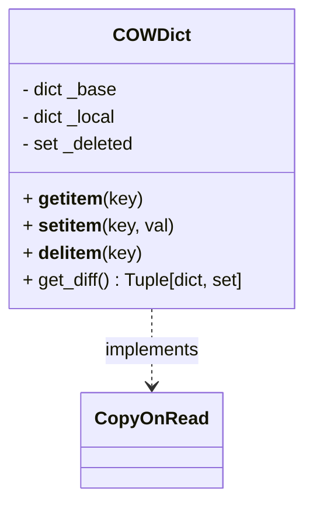
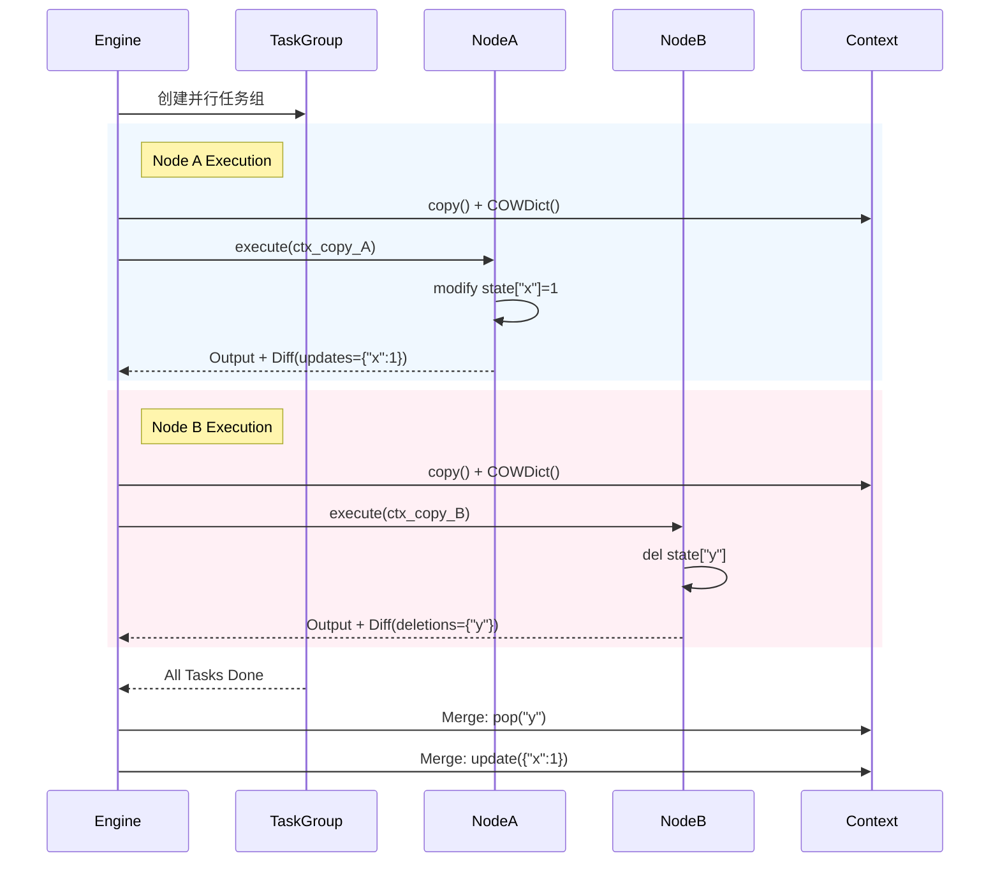
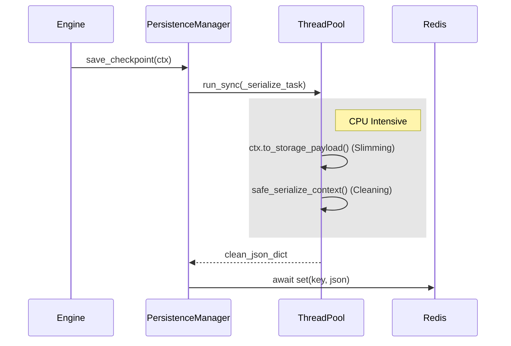

# Gecko Compose 模块详细设计文档 (v0.5)

**文档版本**: 0.5 (Stable)
**最后更新**: 2025-12-28
**状态**: 已发布 / 生产就绪

---

## 1. 引言

### 1.1 设计目标
Gecko Compose 是一个专为 LLM 智能体设计的**工业级编排引擎**。v0.5 版本的设计重心在于解决高并发场景下的**状态一致性**、**系统鲁棒性**与**I/O 吞吐能力**。

核心设计原则：
1.  **并发安全 (Concurrency Safety)**：通过严格的隔离机制，确保并行节点间互不干扰。
2.  **低延迟 (Low Latency)**：避免同步操作阻塞 Event Loop，最大化利用 Python 异步特性。
3.  **可恢复性 (Resumability)**：支持细粒度的断点续传，适应长周期任务。
4.  **开发体验 (DX)**：通过智能参数注入和装饰器模式，降低用户接入成本。

### 1.2 适用范围
- 基于 DAG 的复杂工作流编排。
- 多模型/多智能体并行协作（Team 模式）。
- 需要持久化状态的长运行任务。

---

## 2. 系统架构设计

### 2.1 逻辑架构图
系统采用分层模块化设计，核心层负责调度，执行层负责业务逻辑，数据层负责状态管理。

```mermaid
graph TD
    subgraph "Interface Layer (API)"
        WF[Workflow]
        TM[Team]
        ST[@step]
    end

    subgraph "Core Engine Layer"
        Graph[WorkflowGraph<br>(Topology & Kahn)]
        Engine[Engine<br>(Orchestration & Merge)]
        Executor[NodeExecutor<br>(Dispatch & Retry)]
    end

    subgraph "Data & State Layer"
        Context[WorkflowContext]
        COW[COWDict<br>(State Isolation)]
        Trace[NodeExecution]
    end

    subgraph "Infrastructure Layer"
        Persist[PersistenceManager]
        Storage[Redis/DB Interface]
        ThreadPool[Worker Threads]
    end

    WF --> Graph
    WF --> Engine
    Engine --> Executor
    Engine --> COW
    Engine --> Persist
    Executor --> ThreadPool
    Persist --> ThreadPool
    TM --> Executor
```

### 2.2 模块职责划分

| 模块 | 文件路径 | 核心职责 | v0.5 关键特性 |
| :--- | :--- | :--- | :--- |
| **Engine** | `workflow/engine.py` | 主调度循环、并行层级构建、结果合并 | 递归解包 Team 控制流、删除操作合并 |
| **State** | `workflow/state.py` | **[New]** 并行状态隔离容器 | Copy-on-Read、墓碑机制 (Tombstone) |
| **Executor** | `workflow/executor.py` | 节点执行、参数注入、异常重试 | 同步函数自动卸载 (Thread Offloading) |
| **Team** | `team.py` | 多智能体并行/赛马执行 | 输入分片故障隔舱、原子性 Winner 选取 |
| **Persistence** | `workflow/persistence.py` | 状态序列化与存储 | 异步序列化 (CPU Bound 卸载) |
| **Graph** | `workflow/graph.py` | DAG 拓扑维护与排序 | Kahn 算法分层、环检测 |

---

## 3. 核心机制详细设计

### 3.1 状态隔离与 Copy-On-Write (COW)
**痛点解决**：P0 级并发数据污染问题。

#### 设计逻辑
在并行执行层（`Layer`）中，每个节点获得主上下文的**写时复制副本**。v0.5 引入了增强版 `COWDict`：

1.  **Read (Copy-on-Read)**:
    - 读取不可变对象（int, str）：直接返回引用。
    - 读取可变对象（list, dict）：**立即触发 DeepCopy**，并将副本存入 `_local`。
    - *目的*：防止节点 A 修改列表影响节点 B。

2.  **Write**:
    - 所有修改仅写入 `_local`，不污染 `_base`。

3.  **Delete (Tombstone)**:
    - 删除操作在 `_deleted` 集合中记录 Key（墓碑）。
    - 读取时若 Key 在 `_deleted` 中，抛出 `KeyError`。

4.  **Merge (Last-Write-Wins)**:
    - 引擎按顺序合并结果。
    - 先执行 `deletions`（移除主状态中的 Key），再执行 `updates`（覆盖主状态）。

#### 类图设计


### 3.2 异步调度与线程卸载 (Async Dispatch)
**痛点解决**：P1 级 Event Loop 阻塞问题。

#### 调度策略
`NodeExecutor` 根据函数签名自动决定执行策略：

1.  **检测**：使用增强的 `is_async_callable` 判断目标函数是否为协程。
2.  **路由**：
    - **Async Function**: 直接 `await func(...)`。
    - **Sync Function**: 使用 `anyio.to_thread.run_sync(func, ...)` 封装。
3.  **效果**：即使节点函数包含 `time.sleep` 或 `requests.get`，主线程的心跳也不会停止，确保 `Team` 中的其他并发任务正常运行。

### 3.3 团队协作与控制流穿透
**痛点解决**：P0 级 Team 吞噬 `Next` 指令问题。

#### 递归解包机制
当 `Workflow` 遇到 `Team` 节点时：
1.  Team 并行执行所有成员，返回 `List[MemberResult]`。
2.  Engine 检查返回结果。
3.  **探测逻辑**：遍历 List，检查 `MemberResult.result` 是否为 `Next` 实例。
4.  **决策**：一旦发现 `Next`，立即中断当前静态计划，执行动态跳转。

---

## 4. 数据设计

### 4.1 WorkflowContext
上下文对象是数据流转的核心载体。

```python
class WorkflowContext(BaseModel):
    input: Any                  # 初始输入
    state: Dict[str, Any]       # 全局业务状态 (COW 管理)
    history: Dict[str, Any]     # 节点历史输出 (只读共享)
    executions: List[Trace]     # 执行轨迹 (监控用，持久化时剥离)
    metadata: Dict[str, Any]    # 会话元数据
```

### 4.2 持久化数据包 (Storage Payload)
为了优化 I/O，存储层使用**瘦身**后的数据结构：

```json
{
  "step": 5,
  "last_node": "Node_B",
  "updated_at": 1700000000.0,
  "context": {
    "input": "...",
    "state": "{...}",
    "history": "{...}",  // 仅保留最近 N 步 + last_output
    "next_pointer": null
    // executions 字段被移除
  }
}
```

---

## 5. 关键流程时序图

### 5.1 并行执行与状态合并



### 5.2 持久化流程 (Async Offload)



---

## 6. 接口规范

### 6.1 Workflow 声明

```python
# 定义
wf = Workflow(name="Processing", checkpoint_strategy="final")

# 节点注册
wf.add_node("Step1", func1)
wf.add_node("Step2", func2)

# 依赖构建
wf.add_edge("Step1", "Step2", condition=lambda ctx: ctx.state["ok"])
wf.set_entry_point("Step1")
```

### 6.2 动态控制流 (Next)

```python
# 在节点函数中返回
return Next(
    node="TargetNode",
    input={"data": 123},       # 下一步的 input
    update_state={"flag": 1}   # 同时更新 state
)
```

### 6.3 多智能体 (Team)

```python
# 赛马模式
team = Team(
    members=[agent_a, agent_b],
    strategy=ExecutionStrategy.RACE,
    input_mapper=lambda x, i: x[i] # 可选输入分片
)
```

---

## 7. 非功能性需求分析 (NFR)

### 7.1 性能 (Performance)
- **并发能力**: 在 `Team` 模式下，支持 100+ 轻量级成员并发（受限于 IO 句柄）。
- **调度开销**: 节点间调度延迟 < 1ms。
- **序列化**: 大对象（1MB+）序列化不阻塞主线程。

### 7.2 可靠性 (Reliability)
- **故障隔离**: 单个 Team 成员崩溃不影响整体流程。
- **数据一致性**: 并行写操作遵循 Last-Write-Wins，删除操作具备最高优先级。
- **超时保护**: 全局与局部均支持 `timeout` 参数，防止死锁。

### 7.3 可维护性 (Maintainability)
- **类型提示**: 全代码库 100% Type Hint 覆盖。
- **测试覆盖**: 100% Unit Test Coverage (Branch coverage)。

---

## 8. 风险与限制

1.  **内存开销**: `COWDict` 的 Copy-on-Read 机制在处理超大可变对象（如 1GB 的 DataFrame）时会产生显著内存峰值。
    *   *规避*: 建议在 State 中仅存储数据的引用（如 Redis Key 或 S3 Path），而非数据实体。
2.  **Last-Write-Wins 竞态**: 如果两个并行节点修改同一个 Key，后完成的节点会覆盖先完成的节点。
    *   *规避*: 开发规范应要求并行节点操作互不重叠的 State Key。
3.  **循环依赖**: 虽然支持 `allow_cycles=True`，但复杂的动态跳转可能导致无限循环。
    *   *规避*: 使用 `max_steps` 强制熔断。

---

## 9. 交付物清单

1.  源代码 (`gecko/compose/`)
2.  单元测试套件 (`tests/compose/`, 覆盖率 100%)
3.  性能基准测试脚本 (`benchmarks/`)
4.  本设计文档 (DDD v0.5)
5.  用户指南 (README.md)